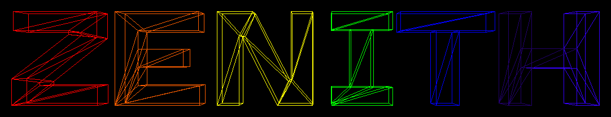

"Zen Engine for Navigating wIreframes In Three-dimensional Holographic space"

## Usage

ZENITH is built with [dune](https://dune.build), and depends on the OCaml `Graphics` library. To run:

```
make run                                            # Will render the Utah teapot .obj file
OBJS="path_to_obj path_to_another_obj ..." make run # Will render each object around a circle
# Renders the demo shown below
OBJS="objs/uv_sphere.obj objs/torus.obj objs/star_destroyer.obj objs/pyramid.obj objs/cube.obj objs/blender_monkey.obj objs/arwing.obj" make run
```


## Writeups

| Checkpoint | Summary |
| ----- | ----- | 
| [Bad Perspective](media/bad_perspective/BadPerspective.md) | My meshes are close to rendering correctly, but some issue with my perspective transformation maps some vertices to the origin | 
| [Success 1](media/success1/Success1.md) | My meshes now render properly |
| [Success 2](media/success2/Success2.md) | I can now load meshes from `.obj` files |

## Notes

### Blender

If you're using Blender to create 3D models for ZENITH, ensure that, in the export window under `Geometry`, the options "Write Normals," "Include UVs," and "Write Materials" are deactivated. These options generate vernacular in the output `.obj` file that my loader does not support.

### Supported .OBJ Vernacular

```obj
# Comments
# Vertices
v 0.0 1.9 -5.8
v 1.1 0.4 -0.7
v 38.4 0.2 7.1
# Lines
l 1 2
l 2 3
# Faces
f 1 2 3
```

### Axis configuration
```
    Y
    |
    |
    | 
    --------- X
   /
  /
 /
Z
```
