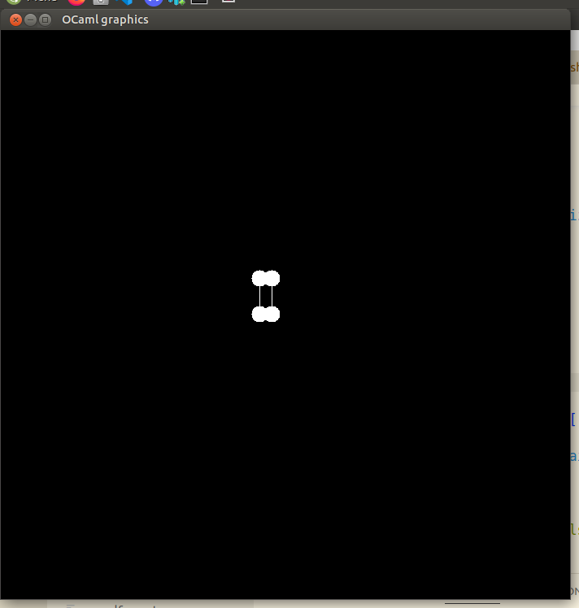
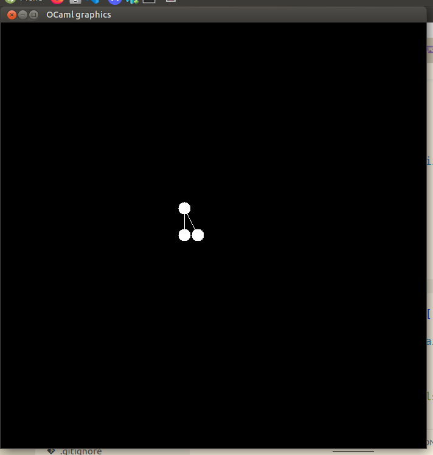
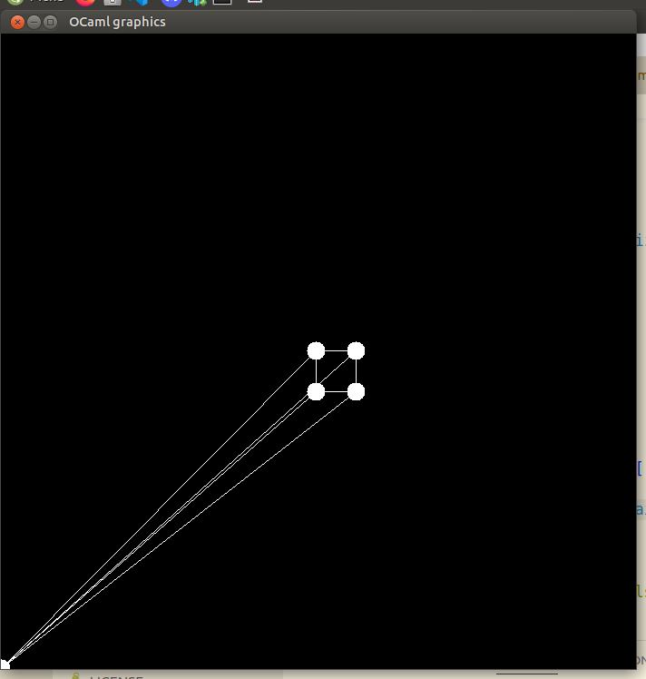
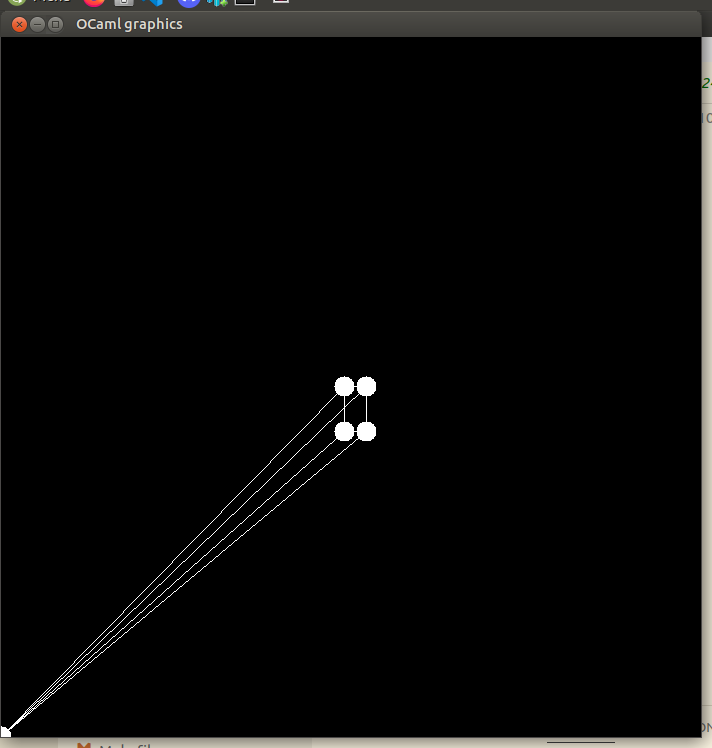
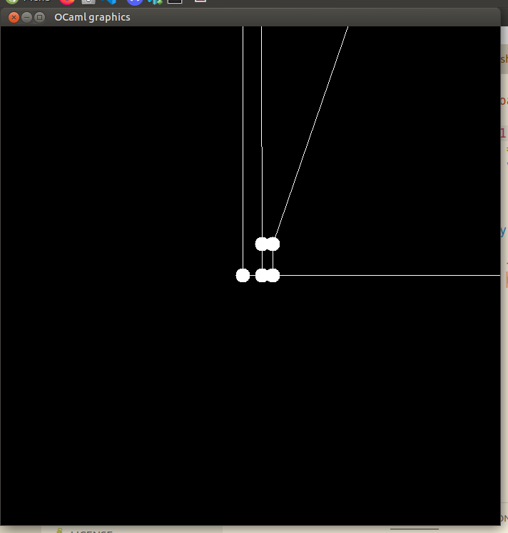
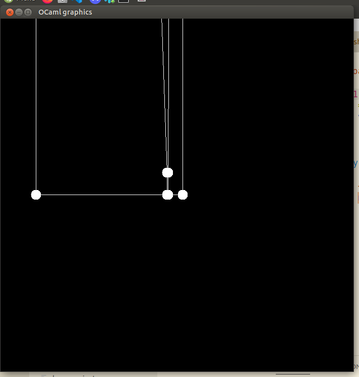

# Bad Perspective Checkpoint

I was excited to get my square and triangle meshes working (vertices on for debugging):

But there's some perspective issue I'm missing that's causing my 3d models to act very strangely.

Here are some rotations of my cube model:

In the first two, the `w` component of the vectors storing the mesh vertices is set to `0`, and in the second, it's set to `1`. I think `0` is correct, its output is arguably closer to the intended behavior. I'm not sure why half of the vertices are fine and half are projected to `(0, 0)`. In the pyramid mesh it's only one vertex that's projected to the origin. Likely candidates for errors are:
- Matrix multiplication algorithm
- Clipping plane misconfiguration
