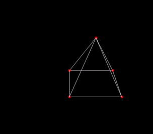

# Success 1

So it turns out my matrix-vector multiplication algorithm was wrong, I had flipped the axis of multiplication. No worries, easy fix:

```diff
let vecmatmul v m =
  let arr = Array.get m.arr in
   {
-    x = vec_dot v { x = arr 0; y = arr 4; z = arr 8; w = arr 12 };
-    y = vec_dot v { x = arr 1; y = arr 5; z = arr 9; w = arr 13 };
-    z = vec_dot v { x = arr 2; y = arr 6; z = arr 10; w = arr 14 };
-    w = vec_dot v { x = arr 3; y = arr 7; z = arr 11; w = arr 15 };
+    x = vec_dot v { x = arr 0; y = arr 1; z = arr 2; w = arr 3 };
+    y = vec_dot v { x = arr 4; y = arr 5; z = arr 6; w = arr 7 };
+    z = vec_dot v { x = arr 8; y = arr 9; z = arr 10; w = arr 11 };
+    w = vec_dot v { x = arr 12; y = arr 13; z = arr 14; w = arr 15 };
   }
```

I added support for all 3 dimensions of rotations:



I think the next step is to get `.obj` loading working, then I'll be able to design in blender instead of having to rely on my faulty manual vertex/edge writing.
